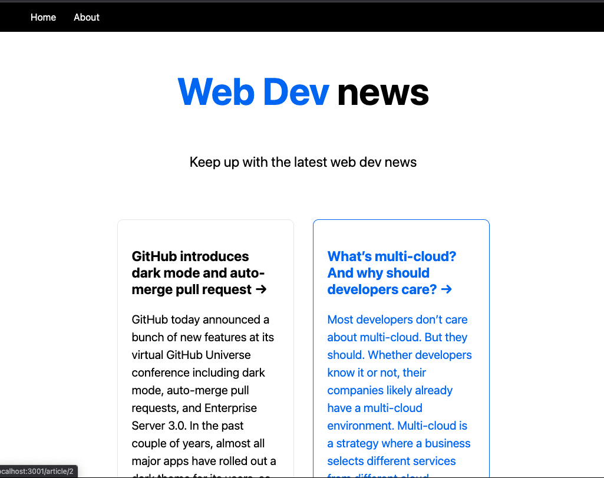

# Web Dev News 

  ### By bridgetvon [Email me](bridget.schaefer31@gmail.com) * 

  ## Table of contents 📚
  * [Description](#Description)
  * [User Story](#User-story) 
  * [Installation Instructions](#installation-Instructions)
  * [Contributing](#Contributing)

  # Visual :eyes:
  
  
 
 
  # Description
    A website to read articles about the latest news in web development. Built with Next.js

  ## User Story :book:
  ```
  AS a web developer
  I WANT to read the latest news in web development 
  SO THAT I can keep up to date on the latest news 

  ```

  ## Installation Instructions :hammer_and_wrench:
  No installation, simply navigate to the deployed application


   

  ## License :credit_card:
  * License Type: N/A


 ## Contributing 
 * Bridget Schaefer [Click to view Bridget's GitHub Profile!](https://github.com/bridgetvon) :skier: